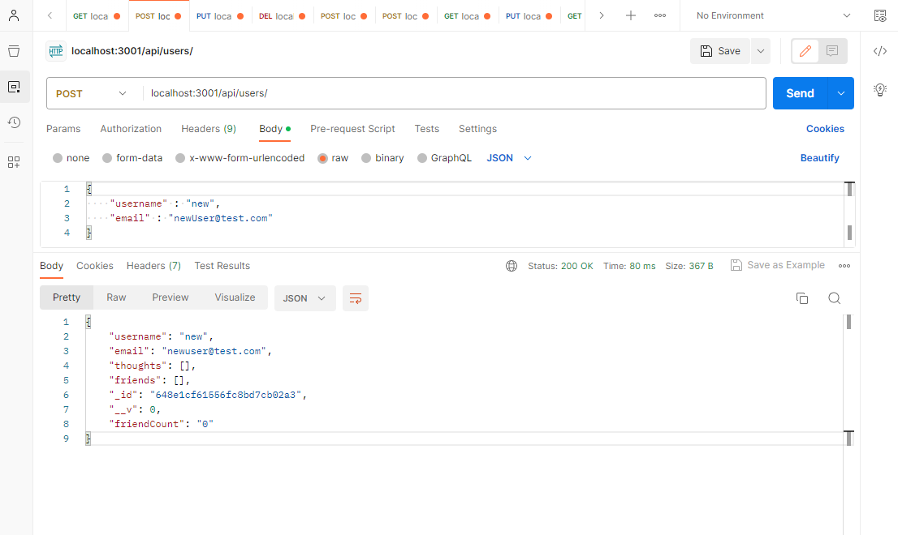
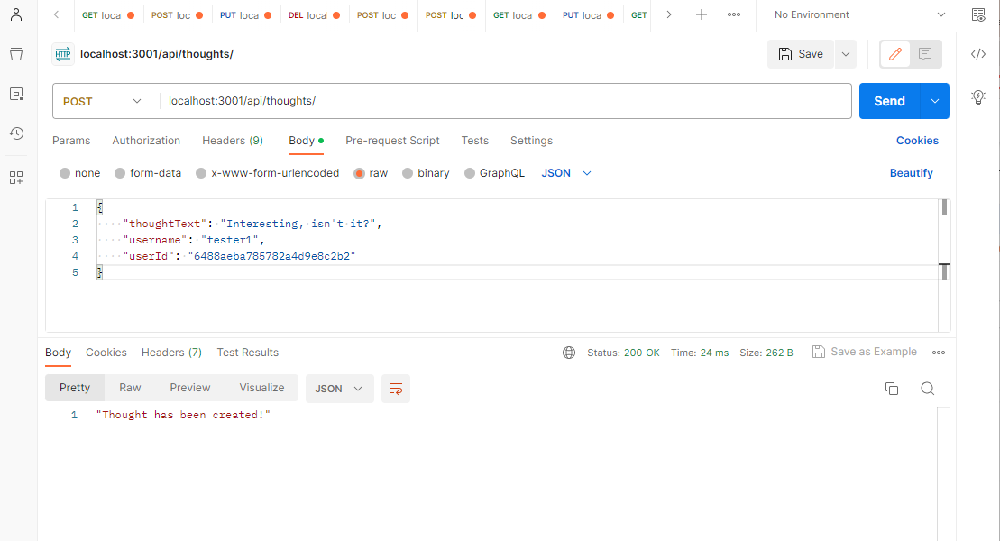
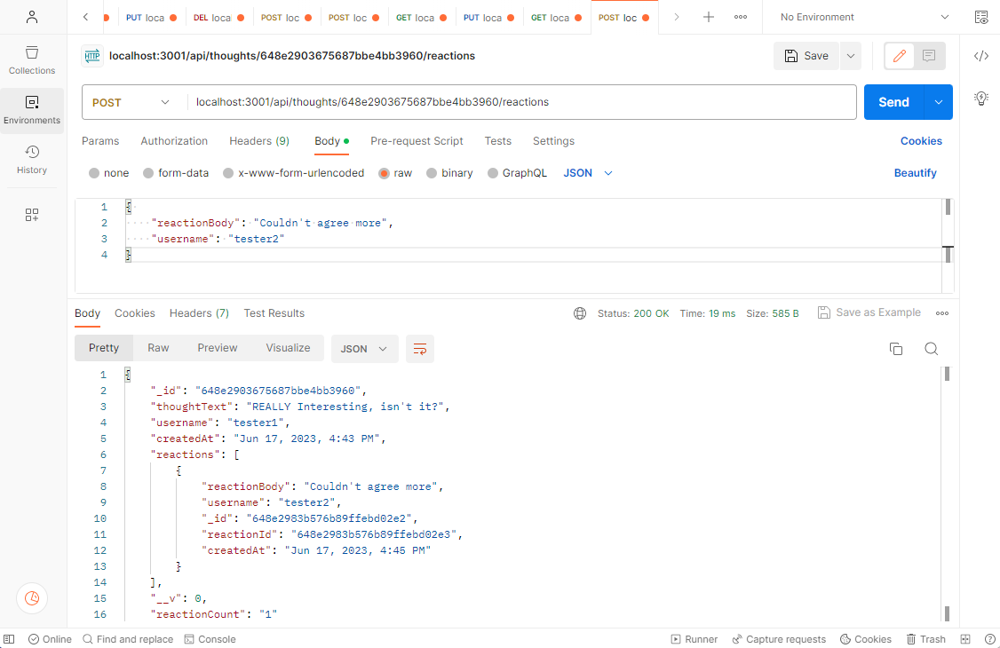

  

  # nosql-no-problem

  ## Description
  
  This repositoy contains the files for a social networking app. Using Express.js API, Node JS, Mongodb and Mongoose, users of this app can create a network that shows and links people by their posted thoughts, reactions, and friends. Through Postman, Insomina, or similar, users can can be added through the use of Mongoose to the MongoDB. The schemas create a web that links users to their posted thoughts, friends, and reactions.

  ## Table of Contents

- [Installation](#installation)
- [Usage](#usage)
- [License](#license)
- [Contributing](#contribution)
- [Tests](#tests)
- [Questions](#questions)

## Installation

Go to https://github.com/joaqsala/nosql-no-problem and clone the repository. Open the contents in VS Code or similar. In the terminal, install all dependencies using npm i. Start your database by entering node index.js. Open Postman or similar and add users, thoughts, friends, and reactions.

## Usage 

Video walk through: https://watch.screencastify.com/v/ZDvEBoXD23Z3HA9IgHRW

Follow the steps in the installation instructions posted above, and run node index.js. Open Postman and start entering your social network. To add users, add a username and email. To add thoughts, add the thoughtText, username, and userId which will link the user with their posted thoughts. Add a friend by including the userID and friends userID into the url. Add a reaction by including the thoughtID in the url and including the reactionBody and username in the body. See the walkthough video for examples.

## License

This project is covered under the MIT License.
 
  https://opensource.org/license/mit/

## Contribution

Contributions are always welcomed. Please submit a pull request.

## Tests

Test the app by adding and editing entries into the database, and then viewing the results.

## Questions

For any questions, please feel free to reach out. 

Github username: https://github.com/joaqsala

Email: joaqsala@gmail.com
